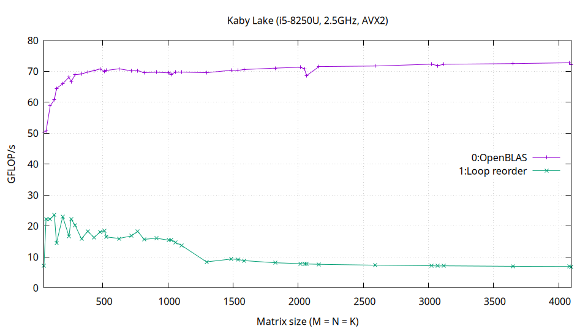
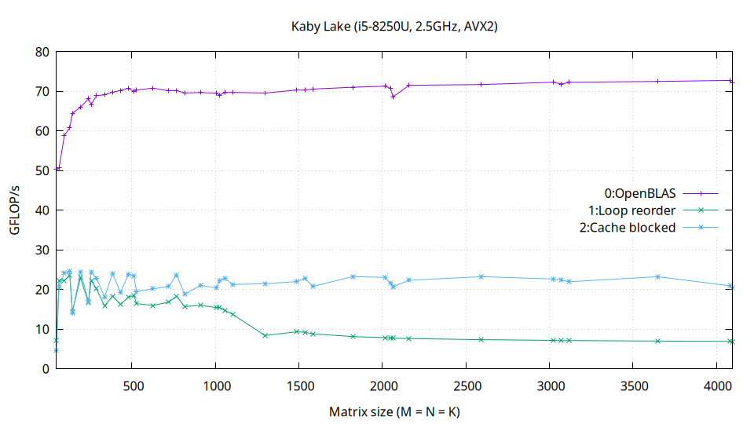
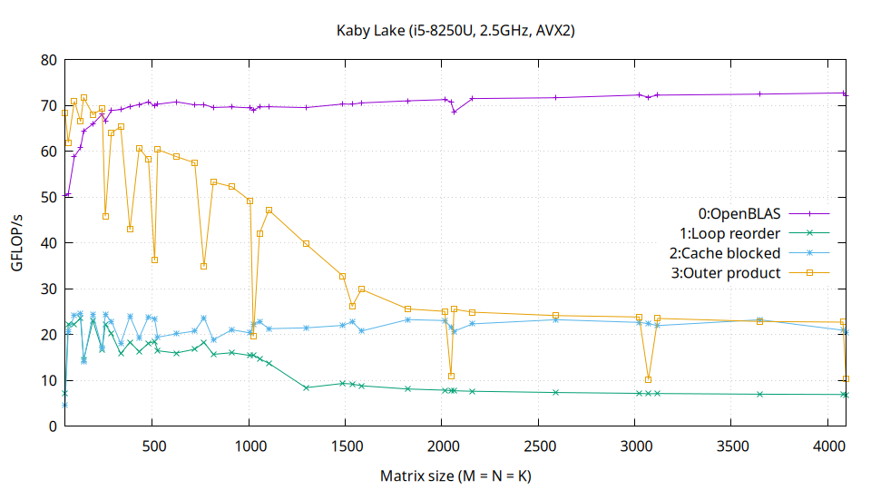
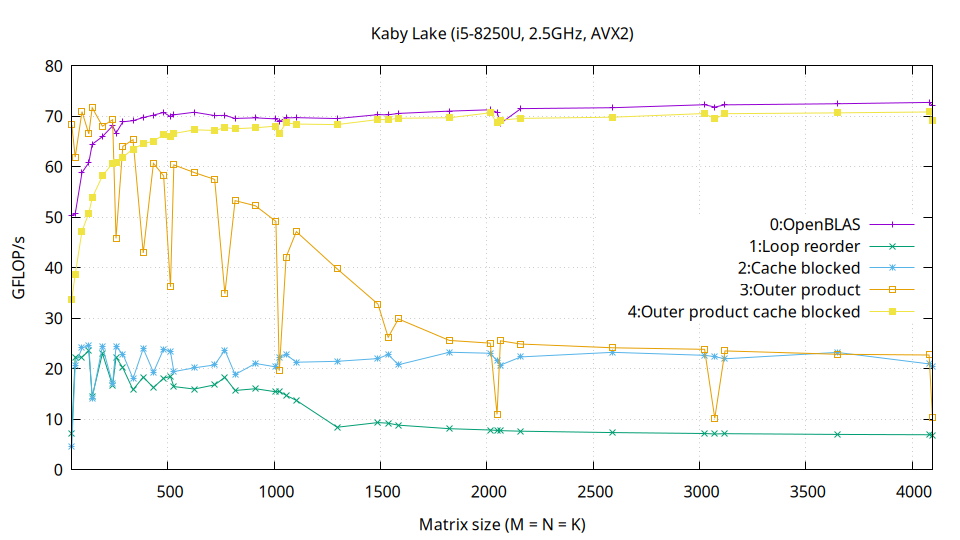
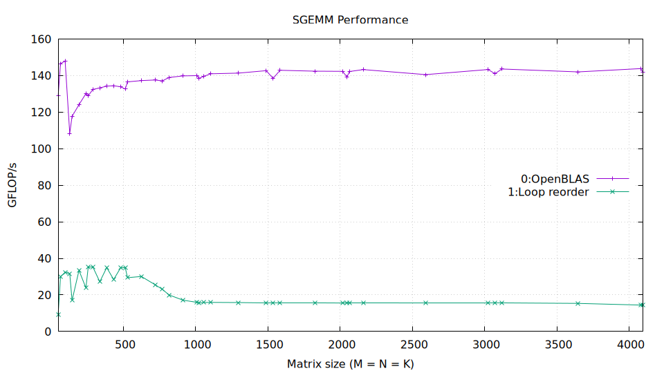
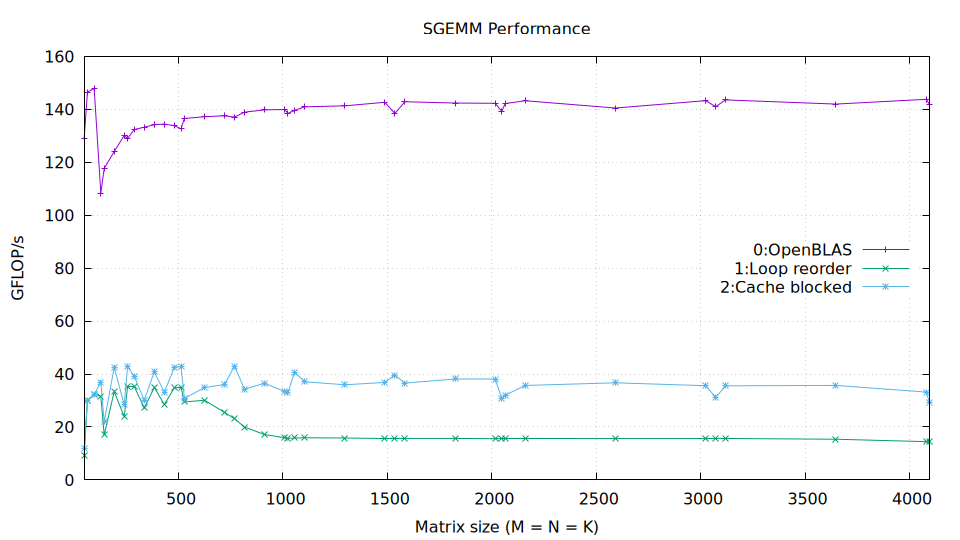
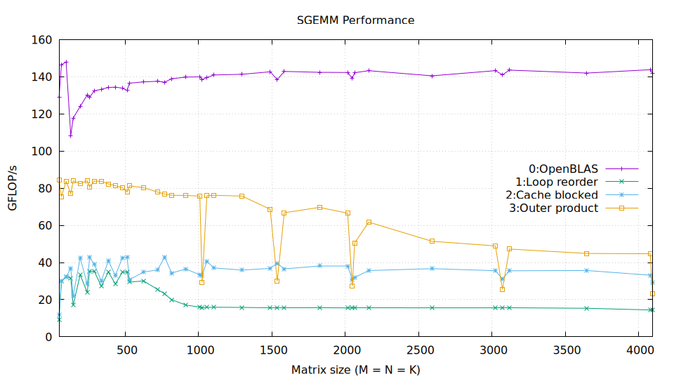
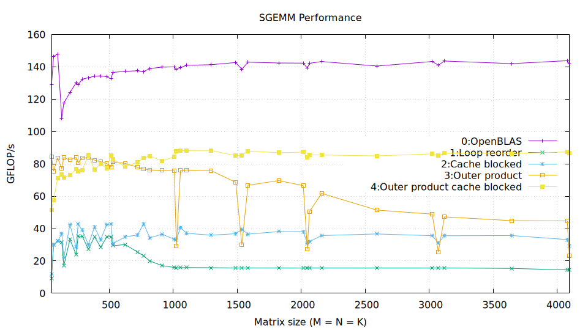
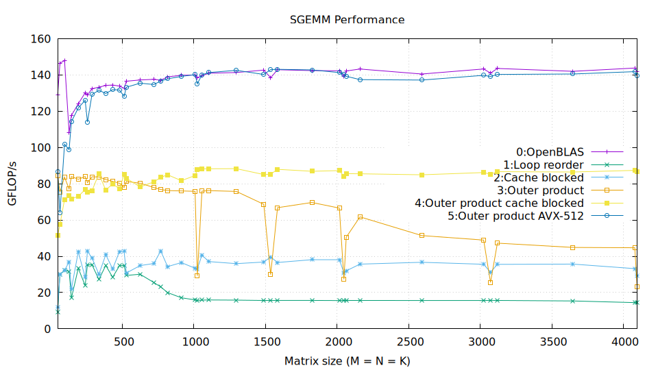

## sgemm.c

An attempt to beat openBLAS for the single precision GEMM operation, in single-threaded.

### Prerequisites

* Install OpenBLAS, build tools, and gnuplot
  ```bash
  sudo apt install libopenblas-dev build-essential gnuplot
  ```

* Compile and run.
  ```bash
  DEBUG=1 make -j4 && ./gemm <kernel_num> <size>
  ```
  Kernel number `0` is the reference sgemm implementation (openBLAS). This should give the peak GFLOP/s on your machine.

  Kernel `5` is compiled with AVX-512F instructions. Running it on a CPU without AVX-512F will terminate with an illegal-instruction signal; kernels `0`–`4` do not require AVX-512F.

* Sweep benchmark.
  ```bash
  DEBUG=1 ./benchmark.sh <kernel_num>
  ```

* Benchmark kernels and plot them.
  ```bash
  make plot
  OMP_NUM_THREADS=1 ./plot
  ```
  This writes the raw measurements once to `output/sgemm_gflops.dat`, then
  creates cumulative plots named `output/sgemm_gflops_0_1.png` through
  `output/sgemm_gflops_0_5.png`. Each plot adds the next kernel to the preceding
  ones. Kernel `5` and its plot are skipped automatically when AVX-512F is not
  supported by the CPU.

## Results

### Intel Core i5-8250U @ 2.5 GHz (AVX2)

The theoretical single-core peak is `2 FMAs/cycle × 2 operations/FMA × 8 floats/FMA × 2.5 GHz = 80 GFLOP/s`.

The varied benchmark sizes include both tile-friendly dimensions and dimensions
that expose cache-associativity conflicts, making the resulting performance
dips visible rather than hiding them behind a regular sweep.

**Kernel 1 — Loop reordering:** Reorder the scalar loops to `i-k-j` so each
value from A is reused while B and C are traversed contiguously.



**Kernel 2 — Cache blocking:** Split the matrices into cache-sized tiles to
retain working data and sustain performance as matrix sizes grow.



**Kernel 3 — Direct tiled outer product:** Compute row-major matrices directly
with a `6x16` AVX2 FMA microkernel, without packing temporary tiles. Avoiding
packing overhead makes it especially fast for small matrices, where it nearly
matches—and at several sizes beats—OpenBLAS.



**Kernel 4 — Cache-blocked outer product:** Add reusable packed panels and
multi-level cache blocking around the AVX2 microkernel to reduce memory traffic.
Prefetching C tiles, unrolling the hot loops, and masked fringe-tile handling
further improve throughput for both full and partial tiles.



The final AVX2 kernel reaches 69 GFLOP/s versus OpenBLAS at 72 GFLOP/s—about
96% of OpenBLAS performance and within 5% of it.

### Intel Xeon Platinum 8488C @ 2.4 GHz (AVX-512)

> [!INFO] 
> Intel CPUs have a known frequency regression on pure AVX-512 workloads. These tests were run on an AWS instance without bare-metal access (and hence no clock pinning). Core frequencies were inferred using `perf` cycles and task-clock events.
> Loaded AVX-512 frequency: 2.4GHz
> Loaded AVX2 frequency: 2.9GHz

The theoretical AVX-512 single-core peak is `2 FMAs/cycle × 2 operations/FMA × 16 floats/FMA × 2.4 GHz = 153.6 GFLOP/s`.

The theoretical AVX2 single-core peak is `2 FMAs/cycle × 2 operations/FMA × 8 floats/FMA × 2.9 GHz = 92.8 GFLOP/s`.

**Kernel 1 — Loop reordering:** Reorder the scalar loops to `i-k-j` so each
value from A is reused while B and C are traversed contiguously.



**Kernel 2 — Cache blocking:** Split the matrices into cache-sized tiles to
retain working data and sustain performance as matrix sizes grow.



**Kernel 3 — Direct tiled outer product:** Compute row-major matrices directly
with a `6x16` AVX2 FMA microkernel, without packing temporary tiles.



**Kernel 4 — Cache-blocked outer product:** Add reusable packed panels and
multi-level cache blocking around the AVX2 microkernel to reduce memory traffic.
Prefetching C tiles, unrolling the hot loops, and masked fringe-tile handling
further improve throughput for both full and partial tiles.



**Kernel 5 — AVX-512 outer product:** Widen the microkernel to AVX-512 with an
`8x48` tile and retune the blocking sizes for the wider vectors. It retains
C-tile prefetching, loop unrolling, and masked fringe-tile handling, which
together bring performance close to OpenBLAS.



At large matrix sizes, the final AVX-512 kernel matches OpenBLAS. At small
matrix sizes it remains slower because it always packs, while OpenBLAS selects
a direct path. Kernel 3 demonstrates direct GEMM, but the AVX-512 kernel does
not include a direct path.

## License
MIT
